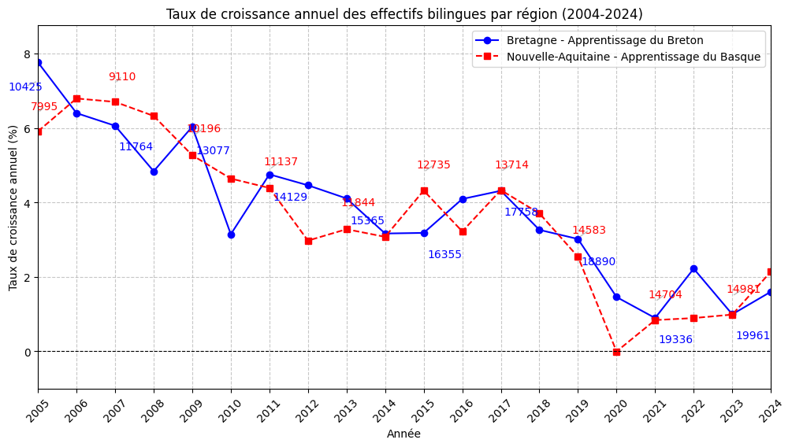

# 🇫🇷 FR – Data & Territories  
### Analysis of Regional Languages in Brittany and Nouvelle-Aquitaine

---

## 🎯 Project Overview

**FR-Data_and_Territories** is a data-driven project focused on the study of **regional languages in France**, with a particular focus on:

- **Breton** (Brittany)  
- **Basque, Occitan, Poitevin-Saintongeais** (Nouvelle-Aquitaine)

The project aims to analyze:

- language use in both regions,  
- their presence in the education system,  
- territorial and demographic dynamics,  
- and public policies supporting linguistic revitalization.

It combines sociolinguistic data, regional datasets, geospatial analysis, and Python-based cartographic visualizations.

---

## 🗺️ Summary of the GeoPandas / Matplotlib Script

The Python script performs the following tasks:

### **1. Loading and harmonizing geographic layers**
- Municipalities of France  
- Departments of Brittany & Nouvelle-Aquitaine  
- Locations of linguistic structures (training programs, weekly groups, summer courses)

All layers are reprojected to **EPSG:4326** for consistency.

### **2. Defining the study area**
The project merges the departments of both regions to:

- filter only the municipalities within the target area  
- select the linguistic activities (training, groups, courses) located inside the region

### **3. Visualizing the data**

The script produces a map showing:

- municipalities (light grey background)  
- department boundaries (black contours)  
- linguistic structures:

| Type | Color |
|------|--------|
| Long-term training programs | 🟨 Yellow |
| Weekly conversation groups | 🔴 Red |
| Summer language courses | 🟧 Orange |

The resulting map provides a **clear overview of the linguistic infrastructure** in Brittany and Nouvelle-Aquitaine.
### **4. An Example of the produced plot:

---

## 📊 Summary of the Poster (PDF)

The poster *Data Challenge 2025 – Group 8 “Les Datarés”* presents a comparative analysis of regional languages in both territories.

### 🔎 General Findings
- Both regions increasingly develop cultural and educational policies to support regional languages.  
- Although the number of speakers is declining, political involvement is growing.  
- French remains dominant due to France’s centralized structure.

### 📚 Education
- **Brittany**: 11% bilingual schools in Breton, 1% in Gallo.  
- **Nouvelle-Aquitaine**: 2.3% bilingual schools in Occitan, 66% in the Basque Country.  
- Brittany stands out thanks to its strong and long-standing educational policy.

### 💶 Public Funding (2023)
- Breton Language Office: **€3,054,000**  
- Occitan: **€1,307,000**  
- Basque: **€1,170,000**  

→ Brittany receives significantly higher funding than Nouvelle-Aquitaine.

### 👥 Linguistic Demographics
- Basque: **20.1%** of speakers (2024)  
- Breton + Gallo: **6%**  
- Occitan: low number of speakers, limited academic support

### 📌 Conclusion
- **Brittany** → highly proactive in revitalizing its language  
- **Nouvelle-Aquitaine** → rich linguistic diversity but less homogeneous support  
- Education appears to be the key mechanism for long-term language preservation.

---

## 📁 Datasets Used

- Sociolinguistic surveys (OPLO, Mintzaira, TMO, LangueBretonne.fr)  
- Regional datasets on bilingual education  
- GeoJSON files for municipalities & departments  
- Field data on language trainings, cultural events, and weekly groups

---

## 👥 Project Team

Group 8 *“Les Datarés”*  
Alice Ausset, Charles Bensancon, Anthony Fourches, Florian Grolleau,  
Ronan Landormy, Tom Ojardias, Rémi Polaud, Joséphine Wozniak-Veisseyre  
**Sciences Po Saint-Germain-en-Laye, 2025**

---

